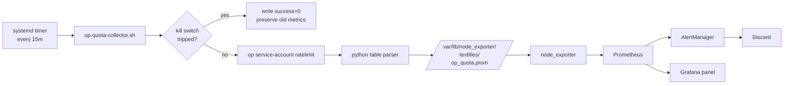

# Design Document

## Overview

Three pieces wired through existing infrastructure, no new components:

1. **Collector script + systemd timer** (ansible-managed): calls `op service-account ratelimit`, parses the table output, writes Prometheus textfile metrics every 15 min on command-center1.
2. **Prometheus alert rules** (k8s-argocd): four graduated alerts on the `account read_write` daily metric, plus a staleness alert on the collector itself.
3. **Grafana panel**: added to an existing Infrastructure or Monitoring dashboard.

The collector sits in ansible-quasarlab because the `op` CLI and token live on command-center1, not in the K8s cluster. The metric text file is read by the node_exporter textfile collector that already runs there. The alert rules and Grafana panel live in k8s-argocd because that's where all monitoring config already lives.

## Steering Document Alignment

### Technical Standards (tech.md)
- Uses existing systemd timer + textfile collector pattern that ansible-quasarlab already uses for `ansible_run.prom`, `ansible_security.prom`, `unattended_upgrades.prom`, `etcd_maintenance.prom`. Zero new infrastructure.
- Uses existing kill-switch library (`scripts/lib/op-killswitch.sh`) so the collector respects the same rate-limit protections as every other op caller.
- Uses PromQL alert style already established (PveGuestDown, EtcdDbSizeLarge) with `for:` thresholds, severity labels, and runbook_url annotations.

### Project Structure (structure.md)
- Ansible role: `ansible-quasarlab/roles/op_quota_collector/` (parallel to `unattended_upgrades/` and `k8s_maintenance/`).
- Alert rules: `k8s-argocd/infrastructure/monitoring/kube-prometheus-stack/values.yaml` under `additionalPrometheusRulesMap` (where all custom rules already live).
- Grafana panel: inline JSON added to an existing dashboard ConfigMap under `k8s-argocd/infrastructure/monitoring/grafana-dashboards/`.

## Code Reuse Analysis

### Existing Components to Leverage

- **`scripts/lib/op-killswitch.sh`** (ansible-quasarlab): The collector sources this and calls `op_killswitch_check_or_exit` at the top, `op_killswitch_scan_file` after `op` fails. Same pattern as `run-proxmox.sh` and `vault-pass.sh`.
- **`OP_SERVICE_ACCOUNT_TOKEN` from `~/.config/op/service-account-token`**: The collector reads this the same way the existing wrappers do. Read-only token is sufficient; `op service-account ratelimit` is a read.
- **Node exporter textfile directory `/var/lib/node_exporter/textfiles/`**: Already scraped, already has file ownership and dir sticky-bit set. Reuse without changes.
- **`additionalPrometheusRulesMap` in kube-prometheus-stack values.yaml**: Add a new group alongside `vm-node-alerts`, `proxmox-alerts`, `etcd-health`, etc.

### Integration Points

- **node_exporter on command-center1**: Scrapes `/var/lib/node_exporter/textfiles/*.prom` every 15s, emits metrics into Prometheus via the existing scrape config. No change needed.
- **Prometheus in K8s**: Scrapes node_exporter. Alerts fire through the existing AlertManager to Discord via discord-alert-proxy. No change needed.
- **Grafana**: Provisioned via the existing sidecar, reads dashboards from ConfigMaps with label `grafana_dashboard=1`. No change needed.

## Architecture



### Modular Design Principles

- **op-quota-collector.sh**: one responsibility, wrap `op` call and persist to textfile. Script is short enough (~80 lines) that no further decomposition is needed.
- **op-quota-parse.py**: 30-line helper that takes the `op` table on stdin, emits Prometheus text format on stdout. Separated from the shell so it can be unit-tested with canned fixtures.
- **Ansible role**: same shape as `unattended_upgrades` and `k8s_maintenance`. One tasks file, templates for the script/service/timer, defaults for the schedule.

## Components and Interfaces

### op-quota-collector.sh

- **Purpose:** Orchestrate the full collect-parse-write cycle for one run.
- **Inputs:** Environment via `/home/ladino/.config/op/service-account-token`. No CLI arguments.
- **Output:** Atomic write of `/var/lib/node_exporter/textfiles/op_quota.prom`. Zero stdout on success, syslog line via `logger -t op-quota-collector` on any failure.
- **Exit code:** Always 0. A failure must not prevent the next firing. Success/failure is surfaced through the `onepassword_ratelimit_collector_success` metric.
- **Dependencies:** `op` CLI, `scripts/lib/op-killswitch.sh`, `op-quota-parse.py`.
- **Reuses:** `op_killswitch_check_or_exit`, `op_killswitch_scan_file` from the kill-switch lib.

### op-quota-parse.py

- **Purpose:** Turn the `op service-account ratelimit` table into Prometheus textfile format.
- **Inputs:** Table text on stdin, e.g.:
  ```
  TYPE       ACTION        LIMIT    USED    REMAINING    RESET
  token      write         100      0       100          N/A
  token      read          1000     0       1000         N/A
  account    read_write    1000     1000    0            5 hours from now
  ```
- **Output:** Prometheus text format on stdout, e.g.:
  ```
  # HELP onepassword_ratelimit_used Requests used in the current window.
  # TYPE onepassword_ratelimit_used gauge
  onepassword_ratelimit_used{type="token",action="read"} 0
  onepassword_ratelimit_used{type="token",action="write"} 0
  onepassword_ratelimit_used{type="account",action="read_write"} 1000
  onepassword_ratelimit_limit{type="account",action="read_write"} 1000
  onepassword_ratelimit_remaining{type="account",action="read_write"} 0
  onepassword_ratelimit_reset_seconds{type="account",action="read_write"} 18000
  onepassword_ratelimit_collector_success 1
  onepassword_ratelimit_collector_timestamp_seconds 1776500000
  ```
- **Reset parsing:** "N/A" becomes absent (no metric line). "5 hours from now" becomes 18000. "23 hours and 59 minutes from now" becomes 86340. Never negative.
- **Reuses:** Python stdlib only (`re`, `sys`, `time`).

### systemd timer + service

- `op-quota-collector.timer`: `OnCalendar=*:0/15` (every 15 min), `Persistent=true`.
- `op-quota-collector.service`: `Type=oneshot`, `User=ladino`, `ExecStart=/usr/local/bin/op-quota-collector.sh`.
- Both deployed by `roles/op_quota_collector`.

### Alert rule group

Appended to `additionalPrometheusRulesMap` in `kube-prometheus-stack/values.yaml`:

```yaml
onepassword-quota:
  groups:
    - name: onepassword-quota-daily
      rules:
        - alert: OnePasswordQuotaHalfConsumed
          expr: onepassword_ratelimit_remaining{type="account",action="read_write"} < 500
          for: 15m
          labels: { severity: info }
        - alert: OnePasswordQuotaLow
          expr: onepassword_ratelimit_remaining{type="account",action="read_write"} < 200
          for: 10m
          labels: { severity: warning }
        - alert: OnePasswordQuotaCritical
          expr: onepassword_ratelimit_remaining{type="account",action="read_write"} < 50
          for: 5m
          labels: { severity: critical }
        - alert: OnePasswordQuotaExhausted
          expr: onepassword_ratelimit_remaining{type="account",action="read_write"} == 0
          for: 0m
          labels: { severity: critical }
        - alert: OnePasswordQuotaCollectorStale
          expr: onepassword_ratelimit_collector_success == 0
          for: 30m
          labels: { severity: warning }
```

### Grafana panel

Added to an existing dashboard ConfigMap in `k8s-argocd/infrastructure/monitoring/grafana-dashboards/`. Target dashboard: whichever Infrastructure/Monitoring dashboard currently shows homelab health (the one with the temperatures panel is a likely candidate).

Panels:
- Gauge: `onepassword_ratelimit_used{type="account"} / onepassword_ratelimit_limit{type="account"}` with thresholds at 0.5/0.8/0.95.
- Time series: `onepassword_ratelimit_used{type="account"}` over 24h with annotation lines at 500, 800, 950.
- Stat: `onepassword_ratelimit_reset_seconds{type="account"}` formatted as duration ("4h 32m").

## Data Models

### Prometheus textfile schema

```
onepassword_ratelimit_used{type,action}           gauge
onepassword_ratelimit_limit{type,action}          gauge
onepassword_ratelimit_remaining{type,action}      gauge
onepassword_ratelimit_reset_seconds{type,action}  gauge  (absent when reset=N/A)
onepassword_ratelimit_collector_success           gauge  (0 or 1)
onepassword_ratelimit_collector_timestamp_seconds gauge
```

Labels:
- `type`: one of `token`, `account`
- `action`: one of `read`, `write`, `read_write`

## Error Handling

### Error Scenarios

1. **`op` CLI not installed or not in PATH:**
   - **Handling:** Collector logs to syslog, writes `onepassword_ratelimit_collector_success 0`, preserves any existing metric file, exits 0.
   - **User Impact:** `OnePasswordQuotaCollectorStale` fires after 30m. Operator investigates the collector host.

2. **Kill switch tripped at collector start:**
   - **Handling:** `op_killswitch_check_or_exit` exits the script before calling `op`. Collector logs a distinct reason (`killswitch=active`), writes `success=0` to the metric file (preserving old data on the other metric lines), exits 0.
   - **User Impact:** Same alert (`CollectorStale`), operator correlates with kill-switch status.

3. **`op` returns a rate-limit error (429) on the ratelimit call itself:**
   - **Handling:** `op_killswitch_scan_file` trips the kill switch, collector logs, writes `success=0`, preserves old metrics, exits 0.
   - **User Impact:** Ironic but handled. The kill switch suppresses all op callers until the limit clears. Metrics go stale; `CollectorStale` fires. This confirms we hit the cap even without live metrics.

4. **Table parse fails (e.g. 1Password changes the output format):**
   - **Handling:** Python helper exits non-zero with a parse error on stderr. Shell captures stderr to syslog, writes `success=0`, preserves old metrics.
   - **User Impact:** `CollectorStale` fires. Operator inspects the `logger -t op-quota-collector` journal entries and updates the parser.

5. **Textfile directory not writable:**
   - **Handling:** Shell check at collector start. Logs a clear error, exits 0.
   - **User Impact:** `CollectorStale`. Operator fixes perms via the existing textfile dir ownership.

## Testing Strategy

### Unit Testing

- **op-quota-parse.py:** Table fixtures captured from real `op` output plus synthetic edge cases (all `N/A` resets, all-exhausted, mixed). Assert exact Prometheus text output byte-for-byte. Run via `python3 -m pytest` in the role's `tests/` directory.
- **op-quota-collector.sh:** `bash -n` syntax check. Integration rather than unit tested because shell logic is mostly wiring.

### Integration Testing

- **Manual run on command-center1** after deploy: `sudo -u ladino /usr/local/bin/op-quota-collector.sh`, then `cat /var/lib/node_exporter/textfiles/op_quota.prom`. Expect valid Prometheus text.
- **Kill switch simulation:** `./scripts/op-killswitch-status.sh trip`, run collector, confirm `success=0` metric and no new `op` call in the journal. Then `clear` and confirm next run populates metrics.
- **Parser regression:** Feed each fixture through the live collector path via a test harness in the role.

### End-to-End Testing

- **Prometheus scrape:** After deploy, `kubectl exec -n monitoring prometheus-kube-prometheus-stack-prometheus-0 -c prometheus -- wget -qO- 'http://localhost:9090/api/v1/query?query=onepassword_ratelimit_used'` should return non-empty results within 30 seconds.
- **Alert fire drill:** Manually set a low threshold variant (e.g. `< 999`) temporarily, confirm Discord receives the alert, then revert. Validates the full chain end-to-end.
- **Grafana panel:** Open dashboard, confirm gauge/time-series/stat all render with live data.
